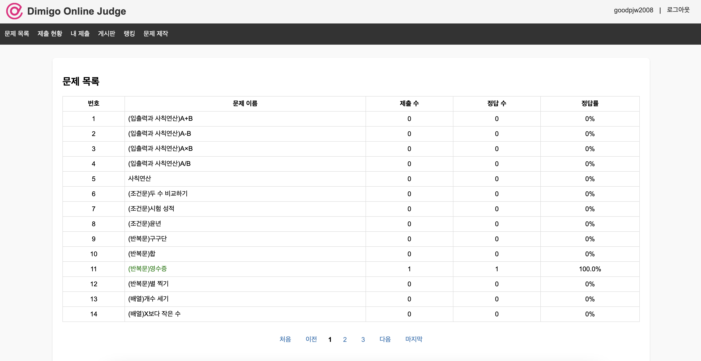
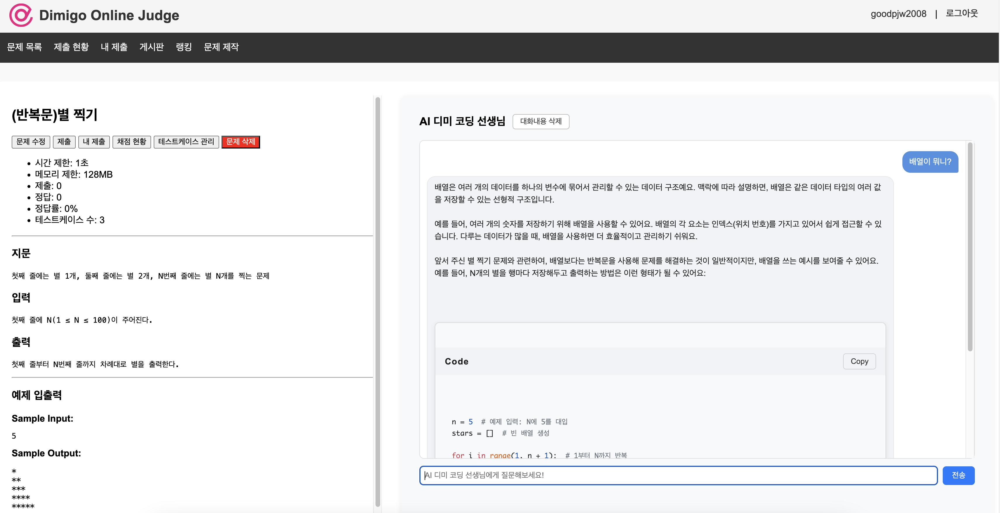
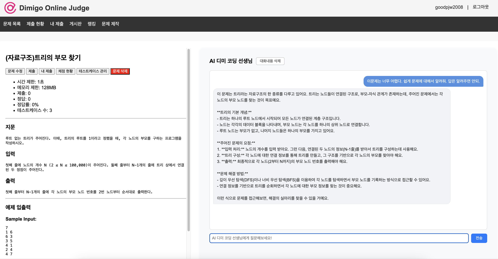
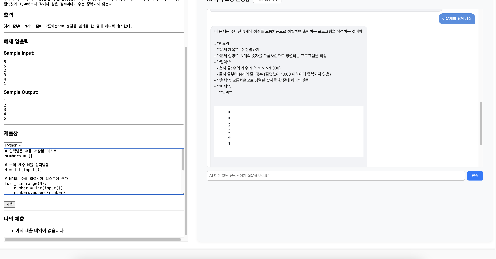
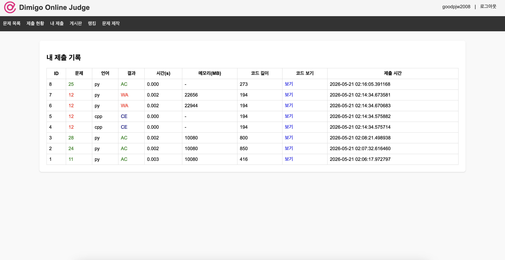
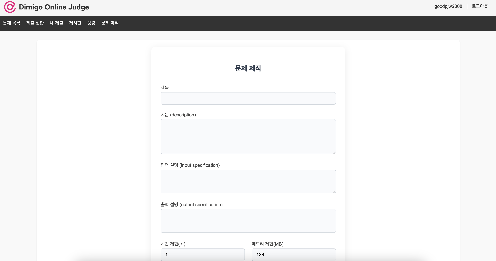

# AI-DimiOJ (Dimigo Online Judge)

중고등학생을 위한 온라인 코딩 문제 해결 플랫폼. 알고리즘 문제 풀이, 자동 채점, **AI 코딩 선생님(GPT) 연동**, 게시판, 랭킹을 제공합니다.

> 📚 **프로젝트 정보**
> 본 프로젝트는 **디지털미디어고등학교 2학년 1학기 정보통신 수업**의 교과 프로젝트로 진행되었습니다.
>
> 📄 **보고서**: [AI-DimiOJ_프로젝트_보고서.pdf](AI-DimiOJ_프로젝트_보고서.pdf)

## 주요 기능

- **사용자 관리**: 회원가입/로그인, AES 암호화된 사용자명, PBKDF2 해시 비밀번호
- **문제 관리**: 문제·테스트케이스 등록, 제한시간/메모리 설정
- **자동 채점**: Python / C / C++ 다중 언어, 샌드박스 실행, 시간·메모리 제한
- **제출 기록**: 개인/전체 제출 현황, 결과 및 코드 확인
- **랭킹**: 해결한 문제 수 기준, Codeforces/AtCoder 티어 연동
- **게시판**: 질문/답변 게시판 (작성/수정/삭제, 페이지네이션)
- **AI 코딩 선생님**: OpenAI `gpt-4o-mini` 기반 문제별 힌트 및 스트리밍 응답
- **보안**: 악성 요청 차단, Rate Limiting (IP당 10초/20회)

## 사용 방법

> 📖 단계별 상세 설명, 화면 설명, FAQ까지 포함된 **[사용자 가이드 (USER_GUIDE.md)](USER_GUIDE.md)** 를 함께 참고해 주세요.

### 1) 문제 목록 둘러보기

상단 네비게이션의 **문제 목록**에서 풀고 싶은 문제를 선택합니다. 각 문제의 제출 수, 정답 수, 정답률을 한눈에 확인할 수 있습니다.

<p align="center">
  
</p>

### 2) AI 디미 코딩 선생님에게 질문하기

문제 페이지 우측의 **AI 디미 코딩 선생님** 채팅창에서 모르는 개념을 물어보면, GPT 기반 챗봇이 친절하게 설명하고 필요할 때 코드 예시도 제공합니다. (질문은 오른쪽 파란 말풍선, AI 답변은 왼쪽 회색 말풍선으로 구분됩니다.)

<p align="center">
  
</p>

후속 질문도 자유롭게 이어갈 수 있습니다. 이전 대화 맥락을 기억해 답변하므로 단계적인 학습이 가능합니다.

<p align="center">
  
</p>

### 3) 코드 작성 후 제출하기

문제 페이지 하단의 **제출창**에서 언어(Python / C / C++)를 선택하고 코드를 작성한 뒤 **제출** 버튼을 누릅니다. 샌드박스에서 자동으로 컴파일·실행되어 채점됩니다.

<p align="center">
  
</p>

### 4) 제출 결과 확인하기

상단 **내 제출** 메뉴에서 제출 기록과 결과(AC/WA/CE/TLE/RE), 실행 시간, 메모리 사용량, 코드 길이를 확인할 수 있습니다. **보기** 링크로 제출한 코드 원본도 다시 볼 수 있습니다.

<p align="center">
  
</p>

### 5) 직접 문제 출제하기

상단 **문제 제작** 메뉴에서 제목·지문·입력/출력 설명·시간/메모리 제한을 입력해 새 문제를 만들 수 있습니다. 생성 후 테스트케이스를 추가하면 다른 사용자가 풀 수 있는 문제가 됩니다.

<p align="center">
  
</p>

## 설치

```bash
# 1) 저장소 클론
git clone <YOUR_REPO_URL> dimeoj
cd dimeoj

# 2) 가상환경 생성 및 활성화
python3 -m venv myenv
source myenv/bin/activate         # Windows: myenv\Scripts\activate

# 3) 의존성 설치
pip install -r requirements.txt

# 4) 환경 변수 설정
cp .env.example .env
# .env 파일을 열어 OPENAI_API_KEY 등을 본인 값으로 채워 넣기

# 5) DB 마이그레이션
flask db upgrade

# 6) (선택) 샘플 문제 시딩
python init_problems_with_testcases.py
```

## 실행

`manage.sh` 스크립트로 서버를 관리합니다.

```bash
./manage.sh start      # 서버 시작 (기본 0.0.0.0:5001)
./manage.sh stop       # 서버 종료
./manage.sh restart    # 재시작
./manage.sh status     # 실행 상태 확인
```

환경 변수로 호스트/포트/워커 수를 조정할 수 있습니다.

```bash
PORT=8080 WORKERS=4 ./manage.sh start
```

- PID 파일: `server.pid`
- 로그 파일: `server.log`

개발 시에는 Flask 개발 서버도 사용 가능합니다.

```bash
python app.py
```

## 디렉토리 구조

```
.
├── app.py                            # Flask 라우트 및 메인 진입점
├── models.py                         # SQLAlchemy 모델 (User, Problem, Submission, Post, TestCase)
├── judge.py                          # 채점 엔진 (샌드박스 실행, 결과 판정)
├── utils.py                          # 암호화/해시/외부 API 헬퍼
├── config.py                         # 환경 설정 (.env 로드)
├── manage.sh                         # 서버 라이프사이클 관리 스크립트
├── run_with_gunicorn.py              # Gunicorn 직접 실행 스크립트
├── requirements.txt
├── .env.example                      # 환경 변수 템플릿
├── init_problems.py                  # 문제 시딩 스크립트
├── init_problems_with_testcases.py   # 문제 + 테스트케이스 시딩
├── migrations/                       # Flask-Migrate 마이그레이션 히스토리
├── instance/                         # SQLite DB 파일 (gitignore)
├── sandbox/                          # 채점 시 코드 실행 격리 디렉토리 (gitignore)
├── static/                           # CSS, 이미지
├── templates/                        # Jinja2 템플릿
└── images/                           # README용 스크린샷
```

## 환경 변수 (`.env`)

| 키 | 설명 | 기본값 |
|---|---|---|
| `OPENAI_API_KEY` | AI 코딩 선생님용 OpenAI API 키 | (필수) |

> ⚠️ `.env` 파일은 `.gitignore`에 등록되어 있어 커밋되지 않습니다. 절대 API 키를 저장소에 올리지 마세요.

## 라이선스

[MIT License](LICENSE) 하에 배포됩니다. Copyright © 2026 goodpjw2008.

사용된 오픈소스 라이브러리 및 라이선스 목록은 [DEPENDENCIES.md](DEPENDENCIES.md)를 참고하세요.

본 프로젝트는 디지털미디어고등학교 2학년 1학기 **정보통신 수업** 교과 프로젝트로 제작되었습니다.
